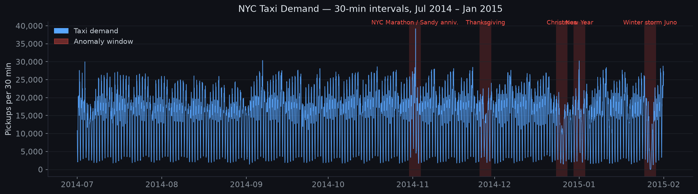
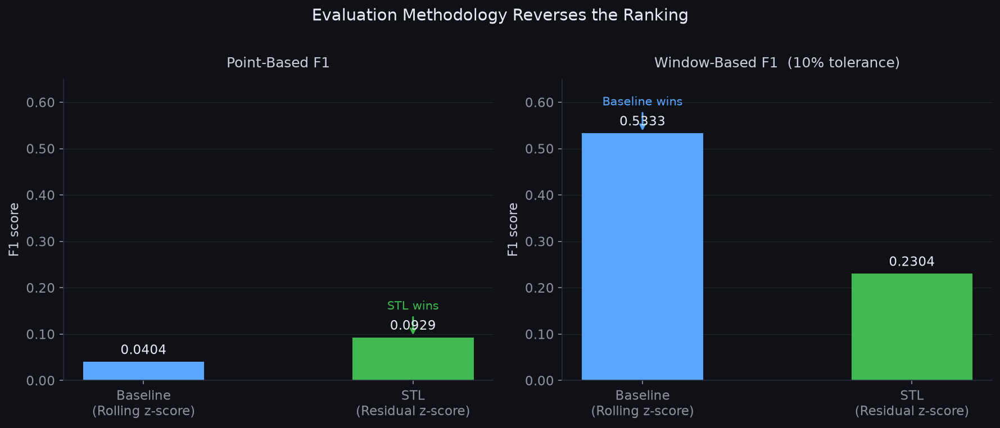
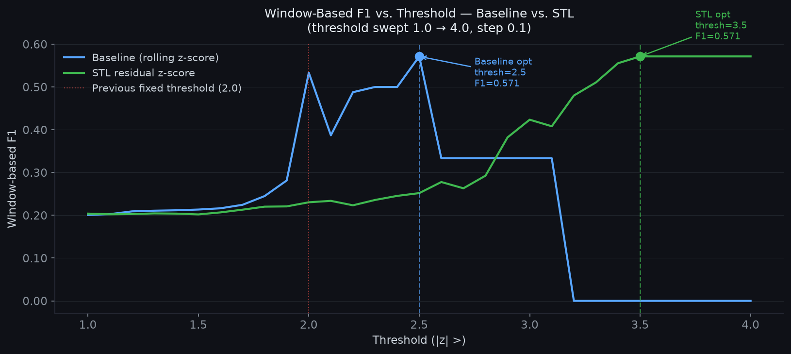
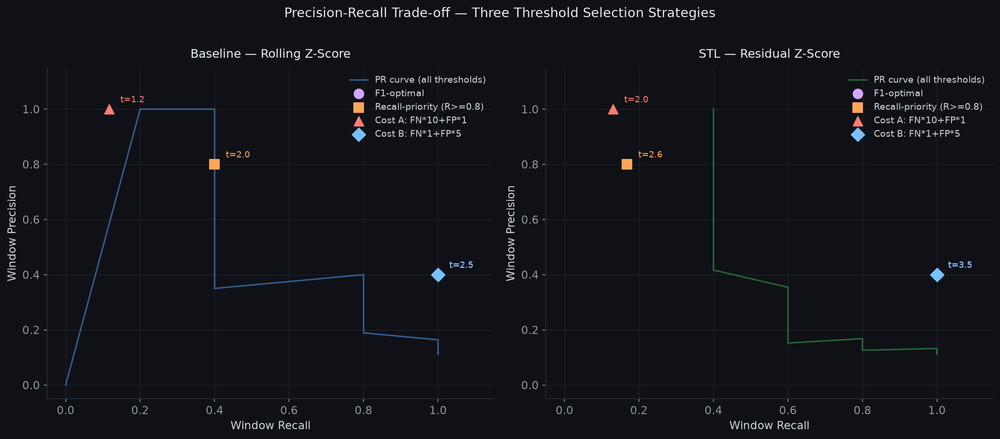

# Time Series Anomaly Detection — Method Comparison


> **TL;DR:** Compared two anomaly detection methods (rolling z-score baseline vs. STL-decomposition residual) on NYC taxi demand data with 5 known anomaly windows (holidays, storms). Point-wise evaluation favors STL (F1=0.093 vs 0.040), but window-wise evaluation reverses the ranking entirely (Baseline F1=0.53 vs STL F1=0.23) — because point-wise metrics penalize slow-onset anomalies unfairly, while STL's higher false-positive rate is only correctly penalized under window-based scoring. The choice of evaluation methodology changes which method appears to "win."
>
> **Correction (independent verification):** An earlier version of this README reported Baseline F1=0.035 (point) and F1=0.508 (window). Those numbers were wrong: `pandas.rolling()` includes the current observation in the window, so the implementation was not truly past-only despite the code comment. A `shift(1)` fix was applied after independent verification caught the discrepancy. Corrected numbers are used throughout.

---

## Data

**Source:** [Numenta Anomaly Benchmark (NAB)](https://github.com/numenta/NAB) — `realKnownCause/nyc_taxi.csv`

| Property | Value |
|---|---|
| Total observations | 10,320 |
| Sampling frequency | 30 minutes |
| Time range | 2014-07-01 → 2015-01-31 (7 months) |
| Anomaly windows | 5 |
| Anomaly points (within windows) | 1,035 (10.0%) |
| Normal points | 9,285 (90.0%) |

### Labeled Anomaly Windows

| # | Start | End | Known Cause |
|---|---|---|---|
| 1 | 2014-10-30 15:30 | 2014-11-03 22:30 | NYC Marathon + Hurricane Sandy anniversary |
| 2 | 2014-11-25 12:00 | 2014-11-29 19:00 | Thanksgiving holiday |
| 3 | 2014-12-23 11:30 | 2014-12-27 18:30 | Christmas holiday |
| 4 | 2014-12-29 21:30 | 2015-01-03 04:30 | New Year holiday |
| 5 | 2015-01-24 20:30 | 2015-01-29 03:30 | Winter storm Juno |

---

## Methodology

### Method 1 — Rolling Z-Score (Baseline)

Computes a rolling mean and standard deviation over a **14-day past-only window** (672 steps). A point is flagged anomalous if its z-score exceeds the threshold.

- Window: 672 steps (14 days, truly past-only via `shift(1)` — the current observation is excluded from its own window)
- Threshold: |z| > 2.0

### Method 2 — STL Residual Z-Score

Decomposes the series into trend, seasonal, and residual components using **STL (Seasonal and Trend decomposition using Loess)**. Anomaly detection runs on the residual only, removing daily and weekly patterns before scoring.

- STL period: 48 (daily seasonality)
- Seasonal window: 337 (weekly seasonality)
- `robust=False` — robust mode suppresses holiday residuals, reducing sensitivity
- Threshold: same |z| > 2.0 applied to global residual std

### Evaluation — Point-Based vs Window-Based

**Point-based:** Each 30-minute step is independently labeled as anomaly or normal. A method must flag the exact correct points to score TP. NYC taxi anomalies are sustained multi-day demand shifts, not spikes — a method may correctly identify that *something is wrong* while scoring low on point recall.

**Window-based (NAB-style):** A window is "detected" if at least one predicted anomaly falls within the window boundaries ± 10% tolerance. Precision is computed as the fraction of predicted points that fall inside any tolerance zone. This rewards early detection and avoids penalizing methods for not flagging every individual point of a 4-day holiday.

---

## Visualizations

### NYC Taxi Demand — Full Series with Labeled Anomaly Windows



*7 months of 30-minute taxi pickup counts. Red shading marks the 5 labeled anomaly windows (holidays and winter storm). Anomalies are sustained demand shifts lasting several days — not point spikes.*

---

### Main Finding — Evaluation Methodology Reverses the Ranking (fixed threshold = 2.0)



*Left: point-based F1 — STL wins (0.093 vs 0.040). Right: window-based F1 — Baseline wins (0.533 vs 0.230). The same two methods, ranked in opposite order depending solely on the choice of evaluation metric.*

---

### Threshold Sweep — Data-Driven Threshold Selection



*Window-based F1 as a function of threshold (swept 1.0 → 4.0, step 0.1). The red dotted line marks the previously fixed threshold of 2.0. Optimal thresholds (dashed verticals) are chosen by maximising window-based F1.*

**Threshold is not arbitrary — it is optimised per method against window-based F1.**

---

## Key Findings

### Fixed Threshold (|z| > 2.0) — Per-Window Detection (5 windows, 10% tolerance)

| # | Window | Baseline | STL |
|---|---|---|---|
| 1 | 2014-10-30 → 11-03 | **YES** | **YES** |
| 2 | 2014-11-25 → 11-29 | **NO** | **YES** |
| 3 | 2014-12-23 → 12-27 | **YES** | **YES** |
| 4 | 2014-12-29 → 01-03 | **YES** | **YES** |
| 5 | 2015-01-24 → 01-29 | **YES** | **YES** |

**Baseline: 4/5 windows detected — STL: 5/5 windows detected**

### Fixed Threshold — Point-Based vs Window-Based Comparison

| Metric | Baseline (point) | STL (point) | Baseline (window) | STL (window) |
|---|---:|---:|---:|---:|
| Precision | 0.4000 | 0.1238 | 0.4000 | 0.1302 |
| Recall | 0.0213 | 0.0744 | 0.8000 | 1.0000 |
| F1 | 0.0404 | 0.0929 | **0.5333** | 0.2304 |
| TP | 22 pts | 77 pts | 4 / 5 wins | 5 / 5 wins |
| FP | 33 pts | 545 pts | 33 pts | 541 pts |
| FN | 1,013 pts | 958 pts | 1 / 5 wins | 0 / 5 wins |

### Optimal Threshold — Data-Driven Results

Threshold swept from 1.0 to 4.0 (step 0.1); optimal chosen by maximising window-based F1.

| | Baseline | STL |
|---|---:|---:|
| **Optimal threshold** | **2.5** | **3.5** |
| Flags at optimal | 3 | 9 |
| Window Precision | 1.0000 | 1.0000 |
| Window Recall | 0.4000 | 0.4000 |
| **Window F1 (optimal)** | **0.5714** | **0.5714** |
| Window F1 (at thresh=2.0) | 0.5333 | 0.2304 |
| **Gain vs fixed threshold** | **+0.038** | **+0.341** |

Both methods reach the same optimal window-F1 (0.5714) via different paths: Baseline needs a modest upward nudge (2.0→2.5) to shed 33 FP points; STL needs a large jump (2.0→3.5) to eliminate 541 FP points. The STL gain from threshold optimisation is nearly 10× larger than Baseline's because at threshold 2.0 it was flooding false positives.

> **F1 optimization has a blind spot — it weights precision and recall equally, but in real-world monitoring, the cost of missing a genuine anomaly rarely equals the cost of a false alarm. The right threshold depends on the deployment context, not a single metric.**

### Cost-Sensitive Threshold Selection



*Precision-Recall curve for both methods across all thresholds. Four operating points shown per method: F1-optimal, recall-priority (win_R ≥ 0.8), Cost Scenario A (FN×10 + FP×1), and Cost Scenario B (FN×1 + FP×5).*

Three selection strategies compared across both methods:

| Strategy | Description | Baseline thresh | STL thresh |
|---|---|---:|---:|
| F1-optimal | Maximise window-based F1 | 2.5 | 3.5 |
| Recall-priority | win_R ≥ 0.8, then max precision | 2.0 | 2.6 |
| Cost A — critical infra | Minimise FN×10 + FP×1 | 1.2 | 2.0 |
| Cost B — alarm fatigue | Minimise FN×1 + FP×5 | 2.5 | 3.5 |

**Full results by strategy and method:**

| | F1-opt B | F1-opt S | Recall-pri B | Recall-pri S | Cost A B | Cost A S | Cost B B | Cost B S |
|---|---:|---:|---:|---:|---:|---:|---:|---:|
| Threshold | 2.5 | 3.5 | 2.0 | 2.6 | 1.2 | 2.0 | 2.5 | 3.5 |
| Flags | 3 | 10 | 55 | 232 | 3,132 | 622 | 3 | 10 |
| Win Precision | 1.000 | 1.000 | 0.400 | 0.168 | 0.117 | 0.130 | 1.000 | 1.000 |
| Win Recall | 0.400 | 0.400 | 0.800 | 0.800 | 1.000 | 1.000 | 0.400 | 0.400 |
| **Win F1** | **0.571** | **0.571** | **0.533** | **0.278** | **0.209** | **0.230** | **0.571** | **0.571** |
| Win detected | 2/5 | 2/5 | 4/5 | 4/5 | 5/5 | 5/5 | 2/5 | 2/5 |
| Point FP | 0 | 0 | 33 | 195 | 2,820 | 545 | 0 | 0 |
| Point FN | 1,032 | 1,025 | 1,013 | 998 | 723 | 958 | 1,032 | 1,025 |

*B = Baseline, S = STL*

**Key observations:**
- Cost A (missing anomalies is 10× more expensive than false alarms) drives both methods to very low thresholds that detect all 5 windows at the cost of many false alarms.
- Cost B (false alarms are 5× more expensive than misses) coincides with F1-optimal for both methods — FP cost dominates, producing the same FP=0 solution.
- Recall-priority (≥0.8 window recall) forces Baseline to stay at threshold 2.0 and STL to 2.6 — catching 4/5 windows with markedly different precision (0.40 vs 0.17).
- **No single threshold is universally correct.** The optimal threshold spans 1.2–3.5 depending on the cost ratio.

| Parameter | Value |
|---|---|
| Baseline optimal threshold (F1) | \|z\| > 2.5 |
| STL optimal threshold (F1) | \|z\| > 3.5 |
| Cost A cost ratio | FN×10 + FP×1 |
| Cost B cost ratio | FN×1 + FP×5 |
| Baseline lookback | 672 steps (14 days, truly past-only via shift(1)) |
| STL period | 48 (daily), seasonal window 337 (weekly) |
| Window tolerance | 10% of each window length |

---

## Requirements

```
pandas
numpy
scipy
statsmodels
scikit-learn
```

Install:

```bash
pip install pandas numpy scipy statsmodels scikit-learn
```

---

## Usage

```bash
# Step 1 — Run both detectors, compute point-based metrics
python scripts/detect_anomalies.py

# Step 2 — Run window-based evaluation and side-by-side comparison
python scripts/evaluate_windows.py
```

Both scripts read from `data/raw/nyc_taxi.csv` and `data/raw/nab_labels.json`.

---

## Project Structure

```
anomaly-detection-timeseries/
├── data/
│   └── raw/
│       ├── nyc_taxi.csv          # NAB NYC taxi demand (10,320 rows)
│       └── nab_labels.json       # NAB ground-truth anomaly windows
├── scripts/
│   ├── detect_anomalies.py       # Rolling z-score + STL, point-based metrics
│   └── evaluate_windows.py       # Window-based evaluation, side-by-side table
├── notebooks/
├── tests/
├── visualizations/
└── .gitignore
```
